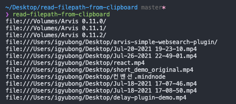

# read-filepath-from-clipboard

Read file paths from clipboard, working on cross-platform

## Usage

Just drag and copy files and execute function.

Function returns selected copied file's paths.

## API

### sync()

Returns file path array.

If file path not exist in clipboard, return empty array.

### async()

Returns file path array.

If file path not exist in clipboard, return empty array.
