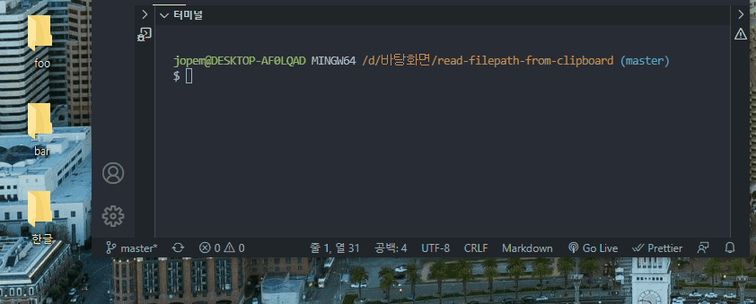

# read-filepath-from-clipboard

Read file paths from clipboard, working on cross-platform

## API

### sync()

Returns file path array.

If file path not exist in clipboard, return empty array.

### async()

Returns file path array.

If file path not exist in clipboard, return empty array.

## Related

- [clipboardy](https://github.com/sindresorhus/clipboardy): API for this module